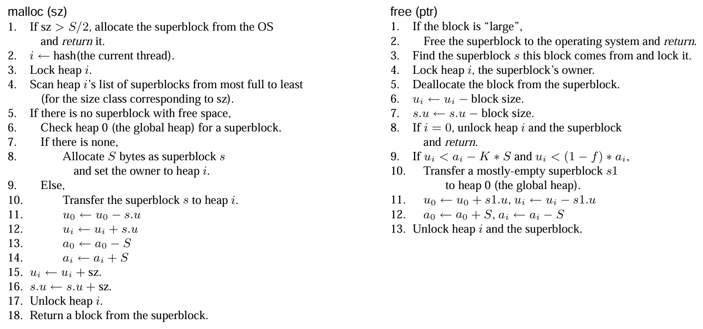

# Hoard

[Hoard Paper](https://dl.acm.org/doi/pdf/10.1145/356989.357000)

### Goal:
- Avoids false sharing
- Bound memory consumption

### Overview:
- One global heap (index `0`)
	 - Accessible by every thread
- Each thread can only access own heap (index `1`..)
- Hash function that maps thread IDs to per-processor heaps
- Maintained usage statistics
	- $u_i$ = amount of memory in use in heap $i$
	- $a_i$ = amount of memory allocated to heap $i$

### Superblocks:
- Array of some number of blocks
    - All blocks are in the same size class
    - Each size class is $b^n$ for some $b > 1; n \in 1...$
    - Round requested size up to nearest size class
        - Bounds worst-case internal fragmentation within a blcock to a factor of $b$
    - Complete empty superblocks can be reused by any size class
- Contains free list of available blocks in LIFO
- All are same size $S$
    - $S$ = multiple of system page size

### Emptiness Threshold
- Move superblock (must be at least $f$ empty) from a per-processor heap to global heap
    - Condition 1: More than fraction $f$ of blocks in heap are not in use
        - $u_i < (1 - f)a_i$
    - Condition 2: There are more than $K$ superblocks' worth of free memory on the heap
        - $u_i < a_i - K * S$

### Fullness Groups
- Doubly-linked lists that contain superblocks in a given fullness range
    - Ex. 3/4 through completely empty superblocks are in the same list
- Superblocks are moved between lists when appropriate
- Always allocate from nearly-full superblocks
- Move-to-front heuristic
    - When a block in a superblock is freed, the superblock is moved to the front of its fullness group.
    - On allocation, the front-most superblock is likely to be reused

### Pseudocode

### Allocation:
- If no memory available in any superblock on a thread's heap:
    - Obtain superblock from global heap if available
    - Else, create new superblock by requesting virtual memory and add to thread's heap
- Keep empty superblocks for reuse instead of returning to operating system
- Objects larger than $S / 2$
    - Allocated via `mmap`
    - Freed using `munmap`
- Small objects
    - Get block from a superblock with free space if exists
    - Else
        - If global heap has superblock
            - transfer superblock to heap $i$
            - update $u_i$ and $a_i$
        - Else (no superblocks in heap $i$ or heap 0)
            - allocate new superblock and insert it into heap $i$
            - choose block from superblock with free space
            - mark block as allocated
            - return pointer to the block

### Deallocation:
- If superblock containing block is large, free it to the operating system

### Block format:
- Header (8 bytes)
    - Pointer to superblock that contains the block
        - Size in bytes if mmap bit is 1
    - mmap bit
        - 1 if allocated via mmap, 0 if in superblock
    - Allocated bit
        - Whether or not this block is in use
- Payload

### Benchmark

Assuming you have already installed `jemalloc`, `mimalloc`, and `hoard` installed on your system.

#### To compile our CSE 506 hoard implementation run:

At the root the project, run
`sudo make so`

This will produce `506-hoard.so` in `/usr/local/lib/`.

Then in the benchmarks folder:

You can `make` in each benchmark and a version of the bench will be compiled with each of the mallocs.

The make file will seek at the following mallocs at the following locations:

| Malloc | Path |
| :--: | :--: |
| 506-hoard | /usr/local/lib/506-hoard.so |
| jemalloc | /usr/local/lib/libjemalloc.so |
| mimalloc | path |
| hoard | path |
